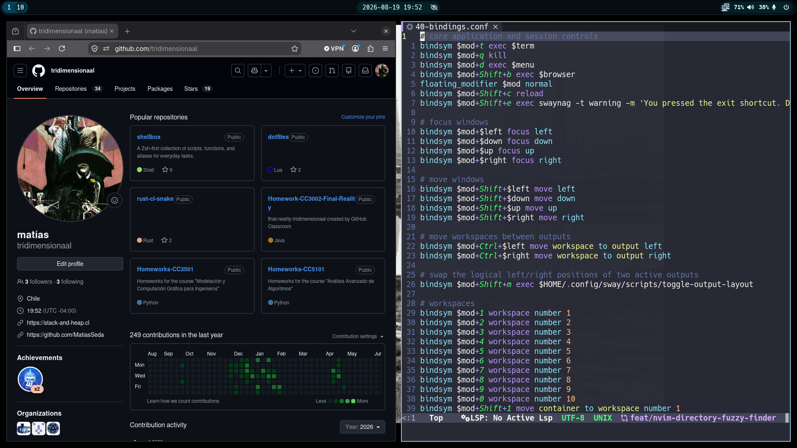
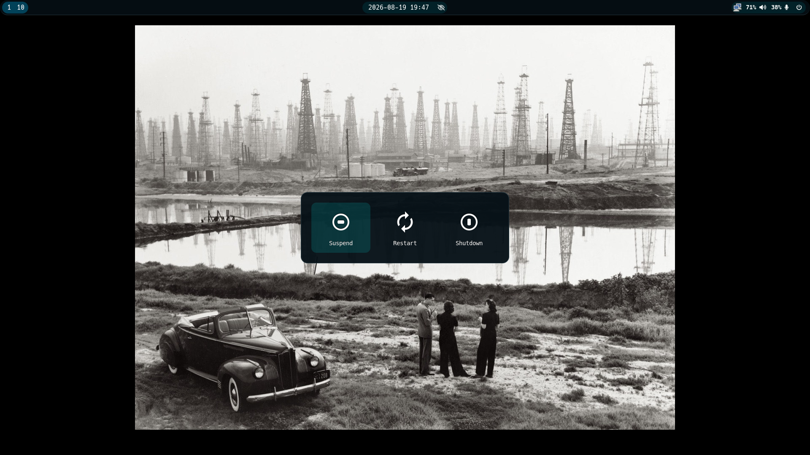
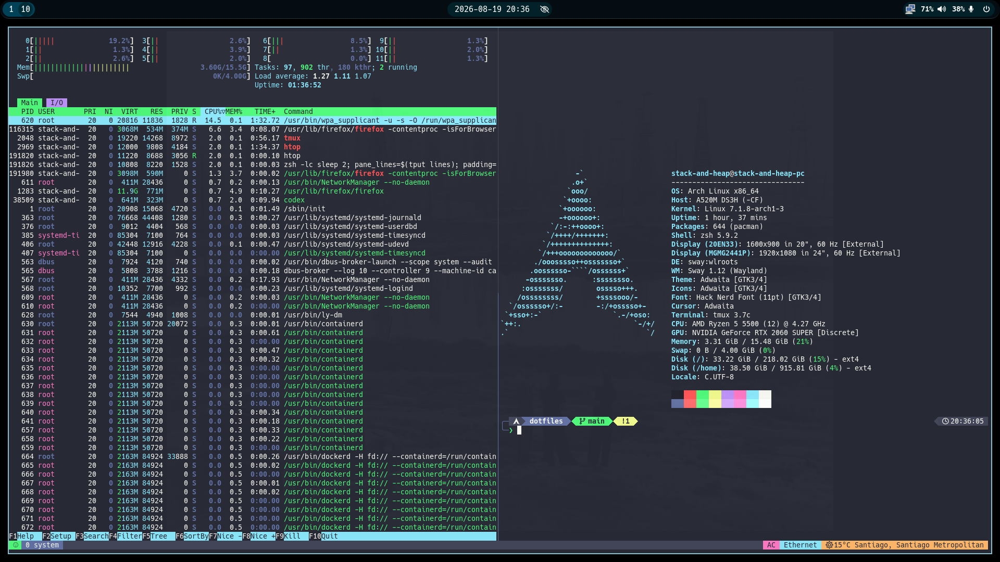

# Dotfiles

Personal GNU Stow dotfiles for an Arch Linux Sway workstation.







## System

- OS: Arch Linux
- Window manager: Sway
- Bar: Waybar
- Terminal: Alacritty
- Shell: Zsh
- Editor: Neovim
- Multiplexer: tmux

## Install

Fresh Arch bootstrap:

```sh
curl -fsSL https://raw.githubusercontent.com/tridimensionaal/dotfiles/main/remote-install.sh | bash -s -- --profile full --yes
```

Fresh Arch GUI-only bootstrap:

```sh
curl -fsSL https://raw.githubusercontent.com/tridimensionaal/dotfiles/main/remote-install.sh | bash -s -- --profile gui --yes
```

Local Arch bootstrap:

```sh
git clone https://github.com/tridimensionaal/dotfiles.git ~/dotfiles
cd ~/dotfiles
./install-arch.sh --profile full --yes
```

Local GUI-only Arch bootstrap:

```sh
git clone https://github.com/tridimensionaal/dotfiles.git ~/dotfiles
cd ~/dotfiles
./install-arch.sh --profile gui --yes
```

Local Stow-only install:

```sh
./install.sh --profile full
./install.sh --profile gui
./install.sh sway waybar
```

Profiles:

- `full`: `nvim`, `tmux`, `alacritty`, `zsh`, `sway`, `waybar`, `gtk`
- `gui`: `alacritty`, `sway`, `waybar`, `gtk`

Use `--dry-run` with any local install command to preview Stow changes.

## Validation

Run `./check.sh` to validate the tracked shell scripts, Starship and nwg-bar configuration, Sway configuration, and output-layout behavior.

## Packages

| Package | Target | Notes |
| --- | --- | --- |
| [nvim](nvim/README.md) | `~/.config/nvim` | Lazy.nvim, Mason, LSP, Treesitter |
| [tmux](tmux/README.md) | `~/.config/tmux`, `~/.tmux.conf` | TPM, vim-style navigation |
| [alacritty](alacritty/README.md) | `~/.config/alacritty` | Dracula theme, Hack Nerd Font |
| [zsh](zsh/README.md) | `~/.config/zsh`, `~/.config/starship.toml`, `~/.zshenv` | XDG layout, Starship prompt |
| [sway](sway/README.md) | `~/.config/sway` | Modular Sway session |
| [waybar](waybar/README.md) | `~/.config/waybar`, `~/.config/nwg-bar` | Sway modules and desktop actions |
| [gtk](gtk/README.md) | `~/.config/gtk-3.0`, `~/.config/gtk-4.0` | Adwaita dark preference |

## Notes

The installer is conservative: it preflights dependencies and Stow conflicts before linking files, is safe to re-run, and does not overwrite conflicting files.

Component behavior and assumptions live in each package README.

To save an encrypted SSH key's passphrase in the graphical login keyring, run `/usr/lib/seahorse/ssh-askpass ~/.ssh/id_ed25519` once, then log out and back in.

Two tracked home-level files are intentional:

- `~/.zshenv` sets `ZDOTDIR="$HOME/.config/zsh"`.
- `~/.tmux.conf` sources `~/.config/tmux/tmux.conf`.

The tracked Zsh config also sources an optional `~/.zshrc`. That file is machine-owned and untracked so installers that do not respect `ZDOTDIR` can add integrations without modifying this repository.
