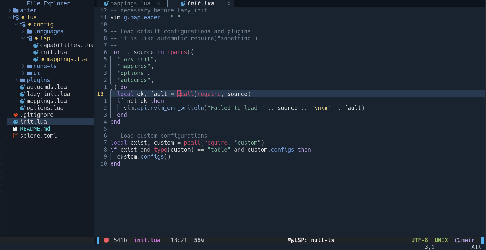

# Neovim config

<p align="center">
  
</p>
<p align="center">
  <em> Personal Neovim setup. </em>
</p>

--- 

## Project Overview

### Purpose

This config is organized around language modules and shared orchestrators.
Each language can define optional building blocks (`lsp`, `format`, `lint`, `options`, `treesitter`, `plugins`), while shared setup modules wire them together.

### Notes

- Uses Lazy.nvim for plugin management (`lua/lazy_init.lua`).
- Plugin specs live in `lua/plugins/`.
- Language-specific extras are pulled from `lua/config/languages`.
- Keymaps, options, and autocmds are in `lua/mappings.lua`, `lua/options.lua`, and `lua/autocmds.lua`.

--- 

## Project structure

- `init.lua`: entry point, loads core modules and optional `custom` module.
- `lua/lazy_init.lua`: bootstraps Lazy.nvim and loads plugin specs.
- `lua/plugins/`: one plugin spec per file (Lazy.nvim format).
- `lua/config/languages/`: per-language config (LSP, lint, format, options) plus optional language plugins.
- `lua/config/lsp/`: shared LSP config (capabilities, mappings, handlers).
- `lua/config/treesitter/`: shared Treesitter setup and parser aggregation logic.
- `lua/config/ui/`: UI config (statusline, bufferline, colors).
- `lua/mappings.lua`, `lua/options.lua`, `lua/autocmds.lua`: core Neovim setup.

--- 

## How to add a plugin

1. Create a new file in `lua/plugins/` (example: `lua/plugins/todo.lua`).
2. Return a Lazy.nvim spec table from that file.

Example:
```lua
-- lua/plugins/treesitter.lua
return {
  "nvim-treesitter/nvim-treesitter",
  lazy = false,
  branch = "main",
  build = ":TSUpdate",
  config = function()
    require("config.treesitter").setup()
  end,
}
```

--- 

## How to add a language config

### Create the language folder

Create a folder under `lua/config/languages/<lang>/`.

### Create `init.lua`

In `lua/config/languages/<lang>/init.lua`, return a module that conditionally loads submodules with `pcall`.
Supported keys are: `lsp`, `format`, `lint`, `options`, `treesitter`, `plugins`.
All of them are optional.

```lua
-- lua/config/languages/css/init.lua
local M = {}

local ok_options, options = pcall(require, "config.languages.css.options")
local ok_format, format = pcall(require, "config.languages.css.format")
local ok_lint, lint = pcall(require, "config.languages.css.lint")
local ok_lsp, lsp = pcall(require, "config.languages.css.lsp")
local ok_treesitter, treesitter = pcall(require, "config.languages.css.treesitter")

M.options = ok_options and options or nil
M.format = ok_format and format or nil
M.lint = ok_lint and lint or nil
M.lsp = ok_lsp and lsp or nil
M.treesitter = ok_treesitter and treesitter or nil

return M
```

### Optional modules overview

- `lsp`: language servers.
- `format`: formatters (none-ls sources + Mason tool names).
- `lint`: linters/diagnostics (none-ls sources + Mason tool names).
- `options`: buffer-local editor options for the language.
- `treesitter`: parser names used by the shared Treesitter setup.
- `plugins`: extra Lazy specs scoped to that language.

### Add LSP config (optional)

Create `lua/config/languages/<lang>/lsp.lua` when the language needs an LSP server.
Use `server` for one server or `servers` for multiple servers.

```lua
-- lua/config/languages/python/lsp.lua
return {
  server = "basedpyright",
  settings = {
    basedpyright = {
      analysis = { typeCheckingMode = "basic" },
    },
  },
}
```

### Add formatter config (optional)

Create `lua/config/languages/<lang>/format.lua` when the language needs formatting through none-ls.
Expose both `sources = function(null_ls) ... end` and `tools = { ... }`.

```lua
-- lua/config/languages/css/format.lua
return {
  sources = function(null_ls)
    return {
      null_ls.builtins.formatting.prettierd.with({
        filetypes = { "css", "scss", "less" },
      }),
    }
  end,
  tools = { "prettierd" },
}
```

### Add linter config (optional)

Create `lua/config/languages/<lang>/lint.lua` when the language needs diagnostics through none-ls.
Expose both `sources = function(null_ls) ... end` and `tools = { ... }`.

```lua
-- lua/config/languages/css/lint.lua
return {
  sources = function(null_ls)
    return {
      null_ls.builtins.diagnostics.stylelint.with({
        filetypes = { "css", "scss", "less" },
      }),
    }
  end,
  tools = { "stylelint" },
}
```

### Add editor options (optional)

Create `lua/config/languages/<lang>/options.lua` for buffer-local editor behavior (tab width, wrapping, etc.).
Then call `apply()` from the matching filetype entry in `nvim/after/ftplugin/`.

### Add Treesitter parsers for the language

Create `lua/config/languages/<lang>/treesitter.lua` and declare parser names:

```lua
-- lua/config/languages/python/treesitter.lua
return {
  parsers = { "python" },
}
```

Parser flow:
- Aggregation happens in `lua/config/treesitter/languages.lua`.
- Setup (install + `vim.treesitter.start`) happens in `lua/config/treesitter/init.lua`.

### Add language-specific plugins (optional)

If needed, create `lua/config/languages/<lang>/plugins/init.lua` and expose it as `M.plugins` in that language `init.lua`.

```lua
-- lua/config/languages/rust/plugins/init.lua
return {
  require("config.languages.rust.plugins.rustaceanvim"),
  require("config.languages.rust.plugins.crates"),
}
```

### Register the language module

Add the language explicitly in `lua/config/languages/init.lua`.

```lua
local M = {}

M.lua = require("config.languages.lua")
M.python = require("config.languages.python")
M.rust = require("config.languages.rust")
M.markdown = require("config.languages.markdown")
M.css = require("config.languages.css")

return M
```

## About `after/` directory

`after/` is loaded after the main runtime files and plugin runtime files.
In this setup, `after/ftplugin/` is used for filetype-local behavior.

- Put filetype-local overrides in `nvim/after/ftplugin/<filetype>.lua`.
- Keep reusable language logic in `lua/config/languages/<lang>/options.lua`.
- Call the reusable options from the ftplugin file.

Example:

```lua
-- nvim/after/ftplugin/css.lua
require("config.languages.css.options").apply()
```

## TODO

- Replace the custom diagnostics plugin with a more established plugin.
- Add TODO plugin ([folke/todo-comments.nvim](https://github.com/folke/todo-comments.nvim))
- Add fuzzy finder plugin (probably [telescope](https://github.com/nvim-telescope/telescope.nvim))


## References and inspirations

- [AstroNvim/AstroNvim](https://github.com/AstroNvim/AstroNvim)
- [tjdevries/advent-of-nvim](https://github.com/tjdevries/advent-of-nvim)
- [asyncedd/dots.nvim](https://github.com/asyncedd/dots.nvim)
- [nvim-lua/kickstart.nvim](https://github.com/nvim-lua/kickstart.nvim)
- [SnaxVim/SnaxVim](https://github.com/SnaxVim/SnaxVim)
- [j4de/nvim](https://codeberg.org/j4de/nvim/src/branch/master)
